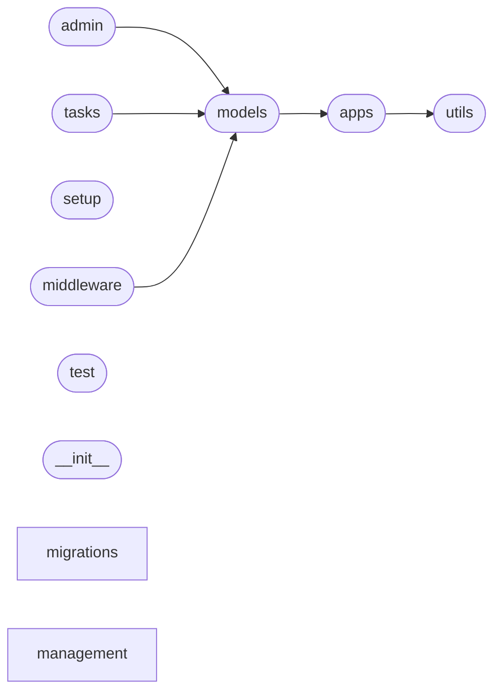

# Code Overview

[_Documentation generated by Documatic_](https://www.documatic.com)

<!---Documatic-section-Codebase Structure Python-start--->
## Codebase Structure Python

The codebase has a 2-deep folder structure,
                with 16 code files in total.

<!---Documatic-block-system_architecture-start--->

<!---Documatic-block-system_architecture-end--->

# #
<!---Documatic-section-Codebase Structure Python-end--->

<!---Documatic-section-Important Functions-start--->
## Important Functions

<!---Documatic-block-important_funcs-start--->
<!---Documatic-block-most_used_funcs-start--->
### Most Utilised Functions

* django_dramatiq.utils.load_middleware (1 times)
<!---Documatic-block-most_used_funcs-end--->
<!---Documatic-block-important_funcs-end--->

# #
<!---Documatic-section-Important Functions-end--->

<!---Documatic-section-Class Hierarchy-start--->
## Class Hierarchy

<!---Documatic-block-AppConfig-start--->

	
<code>AppConfig</code> (Click to Expand!)

* django_dramatiq.apps.DjangoDramatiqConfig

<!---Documatic-block-AppConfig-end--->

<!---Documatic-block-TransactionTestCase-start--->

	
<code>TransactionTestCase</code> (Click to Expand!)

* django_dramatiq.test.DramatiqTestCase

<!---Documatic-block-TransactionTestCase-end--->

<!---Documatic-block-admin.ModelAdmin-start--->

	
<code>admin.ModelAdmin</code> (Click to Expand!)

* django_dramatiq.admin.TaskAdmin

<!---Documatic-block-admin.ModelAdmin-end--->

<!---Documatic-block-django_dramatiq.middleware.AdminMiddleware-start--->

	
<code>django_dramatiq.middleware.AdminMiddleware</code> (Click to Expand!)

* django_dramatiq.middleware.AdminMiddleware
* django_dramatiq.middleware.DbConnectionsMiddleware

<!---Documatic-block-django_dramatiq.middleware.AdminMiddleware-end--->

<!---Documatic-block-migrations.Migration-start--->

	
<code>migrations.Migration</code> (Click to Expand!)

* django_dramatiq.migrations.0001_initial.Migration
* django_dramatiq.migrations.0002_auto_20191104_1354.Migration
* django_dramatiq.migrations.0003_auto_20200204_0842.Migration

<!---Documatic-block-migrations.Migration-end--->

<!---Documatic-block-models.Manager-start--->

	
<code>models.Manager</code> (Click to Expand!)

* django_dramatiq.models.TaskManager

<!---Documatic-block-models.Manager-end--->

<!---Documatic-block-models.Model-start--->

	
<code>models.Model</code> (Click to Expand!)

* django_dramatiq.models.Task

<!---Documatic-block-models.Model-end--->

# #
<!---Documatic-section-Class Hierarchy-end--->

[_Documentation generated by Documatic_](https://www.documatic.com)