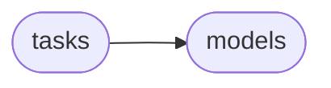

# Django Dramatiq Tasks

[_Documentation generated by Documatic_](https://www.documatic.com)

<!---Documatic-section-Codebase Structure-start--->
## Codebase Structure

<!---Documatic-block-system_architecture-start--->

<!---Documatic-block-system_architecture-end--->

# #
<!---Documatic-section-Codebase Structure-end--->

<!---Documatic-section-django_dramatiq.tasks.delete_old_tasks-start--->
## django_dramatiq.tasks.delete_old_tasks

<!---Documatic-section-delete_old_tasks-start--->
<!---Documatic-block-django_dramatiq.tasks.delete_old_tasks-start--->
<details>
	<summary><code>django_dramatiq.tasks.delete_old_tasks</code> code snippet</summary>

```python
@dramatiq.actor
def delete_old_tasks(max_task_age=86400):
    from .models import Task
    Task.tasks.delete_old_tasks(max_task_age)
```
</details>
<!---Documatic-block-django_dramatiq.tasks.delete_old_tasks-end--->
<!---Documatic-section-delete_old_tasks-end--->

# #
<!---Documatic-section-django_dramatiq.tasks.delete_old_tasks-end--->

[_Documentation generated by Documatic_](https://www.documatic.com)